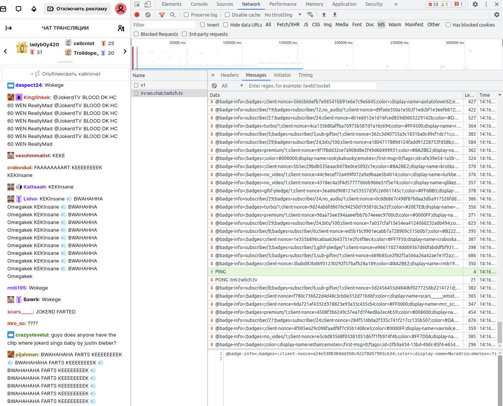

# Websockets
### Определение
WebSocket - это протокол, предназначенный для обеспечения двусторонней связи между клиентом и сервером через одно постоянное соединение. Он был разработан для облегчения создания интерактивных веб-приложений, где обновление данных на клиентской стороне должно происходить в режиме реального времени без необходимости повторной отправки запросов.
Вот основные особенности и отличия WebSocket:

### Особенности

1) Постоянное соединение: В отличие от протокола HTTP, который использует отдельные запросы и ответы для каждого взаимодействия, WebSocket поддерживает постоянное двустороннее соединение между клиентом и сервером. Это позволяет обеим сторонам отправлять и принимать данные без необходимости постоянного установления новых соединений.

2) Низкая задержка: WebSocket обеспечивает низкую задержку и минимальные накладные расходы по сравнению с многими другими методами коммуникации, такими как длинные опросы (long polling) или постоянные опросы (polling).

3) Двусторонний обмен: Клиент и сервер могут одновременно отправлять и принимать данные. Это позволяет создавать интерактивные приложения, где изменения на одной стороне мгновенно отражаются на другой.

4) Сокращение накладных расходов: Поскольку WebSocket использует одно постоянное соединение, это может сократить объем данных, передаваемых в сравнении с многократными запросами и ответами, что может быть полезным для сетей с ограниченной пропускной способностью.

5) Протокол над TCP: WebSocket является протоколом поверх TCP. Для установления соединения между клиентом и сервером используется стандартное веб-сокетное соединение (ws://) или защищенное веб-сокетное соединение (wss://), аналогично тому, как URL HTTP начинаются с http:// или https://

### Применение
WebSocket активно используется для создания интерактивных веб-приложений, онлайн-чатов, игр, мгновенных уведомлений и других приложений, где требуется эффективное двустороннее взаимодействие между клиентом и сервером.

### Примеры
**1) Twitch чат**
